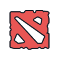

## Hi there 👋, I'm Kirill :)
I'm a FrontEnd developer from Ukraine    
I've been writing FrontEnd for a year.   
Recently started learning BackEnd technologies.  
Also want to learn C++ to improve my Comptuer Sience knolendlge. 

<!--  -->

### About me

**Skills:**
 

<code> 
	
</code>
<code> 
	 
</code>
<code> 
	
</code>
<code> 
	
</code>
<code> 
	
</code>
<code> 
	
</code>
<code> 
	
</code>

**Tools:**
 

<code>
	
</code>
<code>
	
</code>
<code>
	
</code>

**I want to learn:**
 

<code> 
	
</code>

**I engoy to play games as:**
 

<code>
	
</code>
<code>
	
</code>
<code>
	
</code>
<code>
	
</code>